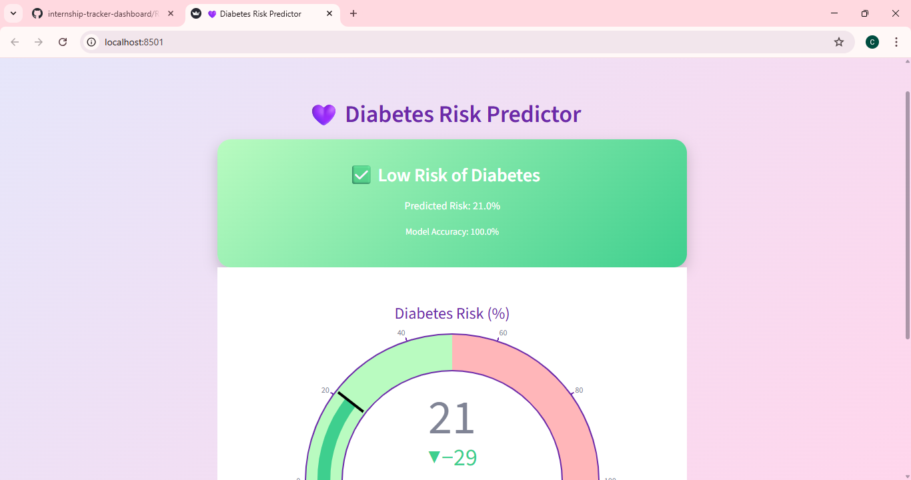
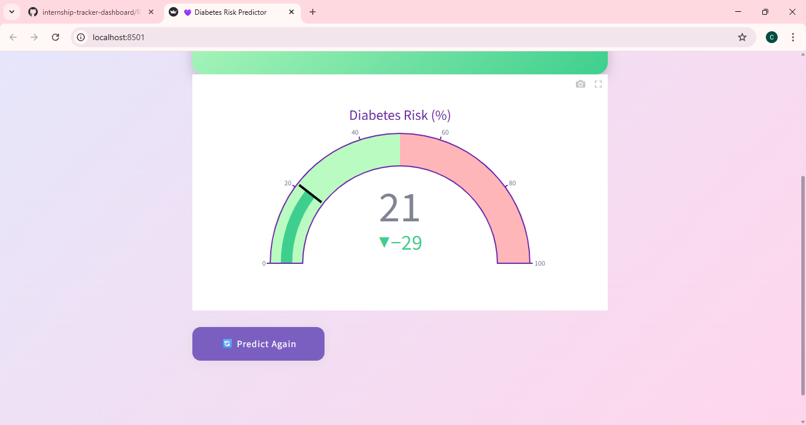

# Diabetes Prediction Dashboard

A web-based diabetes prediction tool built with Streamlit and Python. This dashboard lets users upload data, apply machine learning models, visualize results, and download prediction reports. 

---

## Features

- 🏥 Predict diabetes risk using ML models
- 📊 Interactive visualizations for data analysis
- 📂 Upload data and download results/report
- 👨‍🔬 Multiple analysis pages: Dashboard, Predictor, Results, About, Contact
- 🔐 Secure and user-friendly design

---

## Installation

git clone https://github.com/yourusername/diabetes-prediction.git
cd diabetes-prediction
pip install -r requirements.txt
streamlit run app.py

## Project Structure

├── app.py
├── src/
├── pages/
├── models/
├── data/
├── requirements.txt
└── README.md

---

## Screenshots

### Dashboard Page

### Diabetes Predictor

---

## Contributing

Feel free to submit issues or pull requests for improvements!

